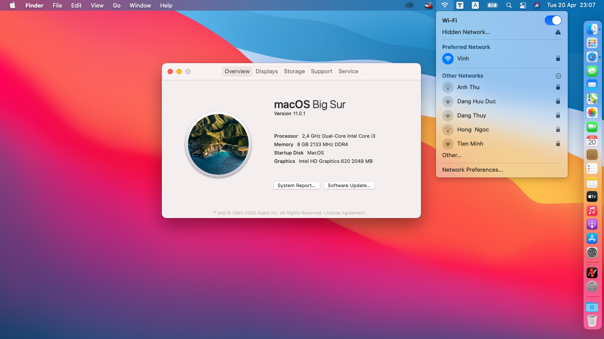

# Bigsur On Dell Inspiron 15 3567

# Specs:
- CPU:	Intel Core i3 Kabylake, 7020U, 2.30 GHz
- Display: 15.6”, HD (1366 x 768), TN
- GPU: Intel Integrated HD Graphics 620
- USB Ports:	1 x USB 2.0, 2 x USB 3.0
- Connectivity: Intel AC 3165
- Ethernet: RTL810xE PCI Express Fast Ethernet controller
- Audio Adapter: Realtek ALC256 - High Definition Audio Controller

# Working:
- Intel HD Graphics 620 2048 MB
- Restart and Shutdown
- CPU Power Management
- Wifi, Bluetooth, Handoff (Intel AC-3165)
- Ethenet 
- Audio (Realtek ALC 256)
- Brightness Key (F11, F12)
- Volumes Key (F1, F2, F3)
- Touchpad
- HDMI Port
- All USB Ports

# Not Working:
- Airdrop
- SDcard Port

# Preview macOS on Dell Inspiron 15 3567:
https://youtu.be/tHiayUbpyO4

# Screenshot:

# Update New Version: Opencore 0.6.9
https://github.com/quangvinhdam/Big-Sur-On-Dell-Inspiron-3567/releases/tag/0.6.9

# Monterey on DEll Inspiron 3567
https://github.com/quangvinhdam/Monterey-On-Dell-Inspiron-3567
